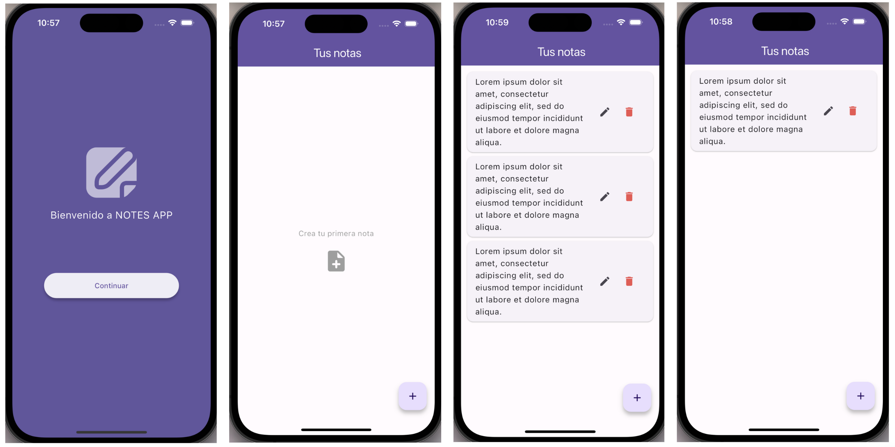
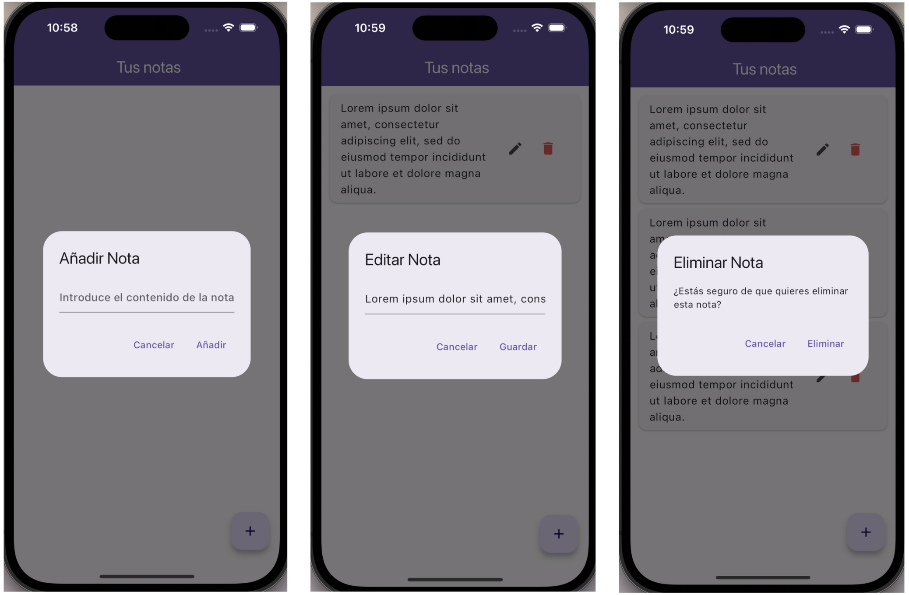

# notes_app

La aplicación móvil de notas tiene como objetivo proporcionar a los usuarios una forma sencilla y eficiente de tomar, organizar y gestionar notas en sus dispositivos móviles. Permite realizar operaciones básicas de creación, lectura, actualización y eliminación (CRUD) de notas, así como almacenarlas localmente en el dispositivo del usuario.

## Requerimientos

- Flutter SDK versión 3.19.4
- Dart SDK versión 3.3.2
- Extensiones en Visual Studio Code, Dart and Flutter.
- Paquetes: sqflite 2.3.3 y provider 6.1.2
- Androis Studio
- Xcode

## Flujo del Diseño

Se incluyen capturas de pantalla que muestran el flujo de diseño de la aplicación, proporcionando una visión general de la interfaz de usuario y la navegación dentro de la aplicación.

- Route



- Crear, Leer, Actualizar y eliminar (CRUD)



## Diagrama Entidad-Relación del Almacenamiento de Datos

Se presenta un diagrama entidad-relación que describe la estructura de la base de datos utilizada para almacenar las notas en la aplicación. Este diagrama proporciona una representación visual de las entidades y las relaciones entre ellas en el esquema de la base de datos.

```markdown
+---------+
| Note |
+---------+
| id |
| content |
+---------+
```


